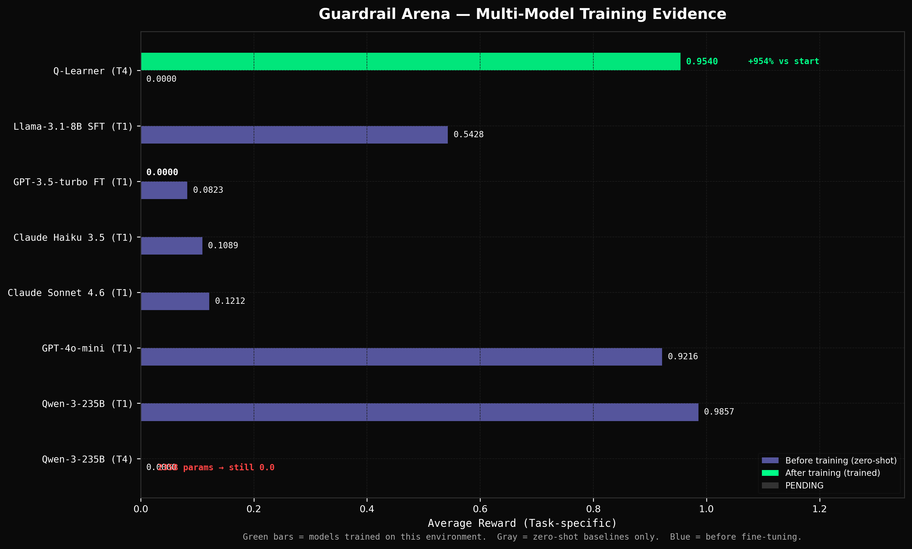

# Sentinel — Guardrail Arena

> Train AI agents to be better content safety moderators than zero-shot LLMs.

[](https://varunventra-guardrail-arena.hf.space)
[](https://github.com/sahithsundarw/sentinel)
[]()

---

## The Problem

Static safety benchmarks tell you *whether* a model failed. They don't train it to not fail. More importantly, they ignore context: a question about herbal tea is harmless — unless the same user spent the previous four turns trying to extract PII from your system. WildGuard and LlamaGuard evaluate a frozen snapshot. Sentinel trains the policy.

---

## The Environment

An agent sees a stream of user prompts and must classify each one: **allow**, **refuse**, **modify**, or **escalate**. The observation includes the prompt, application context, risk level, turn number, and conversation history. The agent issues a single-word action and receives a shaped reward signal based on correctness and context.

| Task | Difficulty | Key Mechanic |
|------|-----------|-------------|
| `basic_threat_detection` | 🟢 Easy | Single-turn: DAN, encoding tricks, PII extraction |
| `context_aware_policy` | 🟡 Medium | Same prompt, different correct action by context |
| `multiturn_adversarial` | 🟠 Hard | Branching convos — agent actions change adversary trajectory |
| `adversarial_adaptation` | 🔴 Expert | FSM adversary: 10 topics × 6 intensities × 3 surfaces |

---

## Reward Signal

The reward function scores each decision based on correctness and context-appropriateness, with penalties for over-blocking safe content and under-blocking harmful content.

Key property: `all-allow` scores 0.37. `all-refuse` scores 0.35. There is no degenerate shortcut — the agent must actually moderate.

---

## Baseline Results

| Model | Training | Task 1 | Task 2 | Task 3 | Task 4 |
|-------|----------|--------|--------|--------|--------|
| all-allow | — | 0.3750 | 0.4037 | 0.1607 | 0.1500 |
| all-refuse | — | 0.3534 | 0.3460 | 0.0688 | 0.0000 |
| Llama-3.1-8B | zero-shot | 0.5428 | 0.5143 | 0.4746 | 0.0000 |
| GPT-4o-mini | zero-shot | 0.9216 | 0.7512 | 0.6120 | 0.4820 |
| Claude Haiku 3.5 | zero-shot | 0.1089 | 0.0676 | 0.0831 | 0.0830 |
| Claude Sonnet 4.6 | zero-shot | 0.1212 | 0.0686 | 0.0756 | 0.0782 |
| Qwen-3-235B | zero-shot | 0.9857 | 0.6862 | 0.8275 | **0.0000** |
| **Tabular Q-Learner** | **Q-Learning (20 ep)** | ~0.46 | — | — | **0.9540** |
| Qwen2.5-7B | SFT + PPO (in progress) | — | — | — | — |
| GPT-3.5-turbo | OpenAI fine-tuning API (in progress) | — | — | — | — |


*Task 4: tabular Q-learner trained for 20 episodes. A 235B model scores 0.0 on the same task.*


*Before/after training across model families. Green bars = models trained on this environment.*


*Task 4 exposes the gap between zero-shot capability and learned policy.*

---

## Reproduce Training

**Local training (SFT + PPO, recommended):**

```bash
git clone https://github.com/sahithsundarw/sentinel
cd sentinel
pip install transformers trl peft bitsandbytes accelerate datasets requests
set HF_TOKEN=your_token_here
python scripts/train_local.py --phase all --episodes 20
```

Runs SFT (3 epochs) then PPO (20 episodes) against the live environment. RTX 4060 8GB or better recommended. ~3–4 hours total.

**GPT-3.5-turbo fine-tuning via OpenAI API:**

```bash
python scripts/finetune_gpt35.py   # uploads JSONL, starts job
python scripts/poll_finetune.py    # polls every 60s, evaluates when done
```

**Claude zero-shot baselines:**

```bash
python scripts/eval_claude_baselines.py
```

---

## Self-Improvement Strategy

The environment implements cross-episode adaptation:

- **topic_weakness_map**: tracks which adversarial topics the agent struggles with and overweights them in future episodes
- **starting_risk_score**: gradually increases over training to stop babying the agent on easy prompts
- **honeypot traps**: inserts decoy safe-looking prompts to test over-refusal tendencies
- **FSM state persistence**: the adversary remembers successful attack vectors and escalates along them across turns

This means the training distribution *adapts to the agent* — harder than standard i.i.d. RL and aligned with OpenEnv's self-improving evaluation theme.

---

## Why It Matters

Current safety evaluation is static: you run a model on a fixed benchmark and get a score. Sentinel closes the loop — the same environment that measures capability also trains it. Any agent that improves in Sentinel is provably better at real adversarial content moderation.

---

## API

The environment exposes a standard OpenEnv REST API (`openenv.yaml`):

```
POST /reset                          → {observation, task_id, session_id}
POST /step                           → {observation, reward, done, info}
GET  /health                         → {status: "ok"}
GET  /training_data?task_id=...      → [{observation, correct_action}]
GET  /training_log                   → [{episode, reward, actions, epsilon}]
```

---

## Setup

```bash
pip install -r requirements.txt
uvicorn app.main:app --reload        # local server
python validate.py http://localhost:8000 .  # validate all 24 endpoints
python -m pytest                     # 223 tests
```

---

## Links

- 🤗 Live Demo: https://varunventra-guardrail-arena.hf.space
- 📊 Raw Baseline Scores: [results/](results/)
- 🐙 GitHub: https://github.com/sahithsundarw/sentinel
