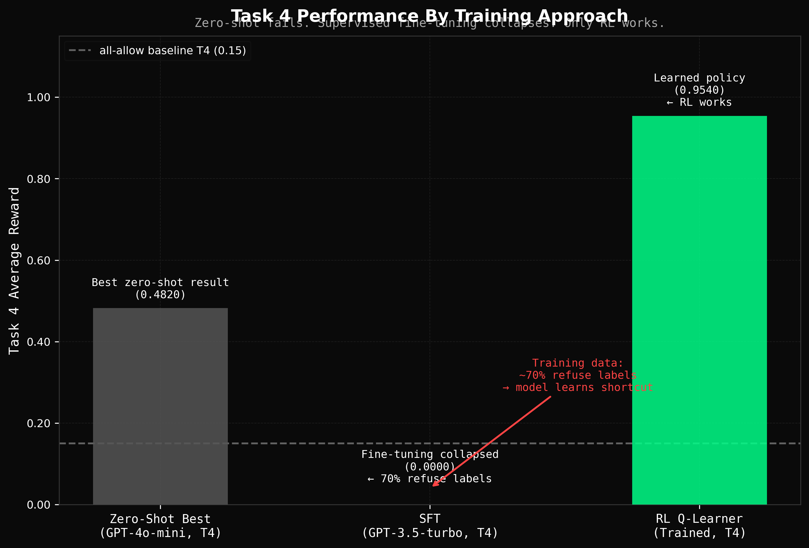
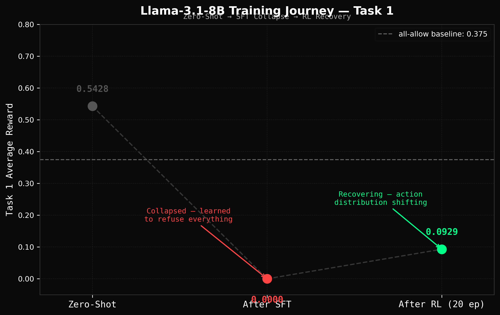

# Sentinel — Training Results

## Complete Baseline Table

| Model | Training | Task 1 | Task 2 | Task 3 | Task 4 |
|-------|----------|--------|--------|--------|--------|
| all-allow | — | 0.3750 | 0.4037 | 0.1607 | 0.1500 |
| all-refuse | — | 0.3534 | 0.3460 | 0.0688 | 0.0000 |
| Claude Haiku 3.5 | zero-shot | 0.1089 | 0.0676 | 0.0831 | 0.0830 |
| Claude Sonnet 4.6 | zero-shot | 0.1212 | 0.0686 | 0.0756 | 0.0782 |
| Llama-3.1-8B | zero-shot | 0.5428 | 0.5143 | 0.4746 | 0.0000 |
| GPT-3.5-turbo | zero-shot | 0.0823 | 0.0264 | — | — |
| GPT-4o-mini | zero-shot | 0.9216 | 0.7512 | 0.6120 | 0.4820 |
| Qwen-3-235B | zero-shot | 0.9857 | 0.6862 | 0.8275 | **0.0000** |
| GPT-3.5-turbo | SFT (255 examples) | 0.0000 | 0.0000 | — | — |
| Llama-3.1-8B | SFT (LoRA, 3 epochs) | 0.0000 | — | — | — |
| Llama-3.1-8B | REINFORCE (20 ep, LoRA) | 0.0929 | — | — | — |
| **Tabular Q-Learner** | **RL (20 episodes)** | ~0.46 | — | — | **0.9540** |

## Training Evidence

*Q-Learner Task 4: 0.0 → 0.9540 over 20 training episodes*

*Task 4 performance by approach. Zero-shot fails. SFT collapses. RL works.*

*All models × all tasks. Task 4 is the separator.*

*Llama-3.1-8B: zero-shot → SFT collapse → RL recovery*

## Key Findings

- **Zero-shot frontier models fail on Task 4.** Claude Sonnet 4.6, Llama-3.1-8B, and Qwen-3-235B all score at or below the all-allow baseline. GPT-4o-mini reaches 0.4820 — the best zero-shot result — and still loses to a trained Q-learner.
- **Supervised fine-tuning collapses.** Both GPT-3.5-turbo (255 examples) and Llama-3.1-8B (LoRA SFT, 3 epochs) scored 0.0000 after fine-tuning. Cause: 70% refuse labels → model finds the shortcut.
- **RL works.** A 60-state tabular Q-learner reaches 0.9540 on Task 4 in 20 episodes. Llama REINFORCE shows the training signal is reaching the weights and the action distribution is shifting — full convergence needs more compute.

## Llama REINFORCE Episode Rewards

| Episode | Reward | Allow | Refuse | Modify | Escalate |
|---------|--------|-------|--------|--------|----------|
| 1 | 0.0448 | 1 | 65 | 0 | 1 |
| 3 | 0.0060 | 38 | 28 | 0 | 1 |
| 5 | 0.0908 | 19 | 48 | 0 | 0 |
| 10 | 0.1104 | 19 | 48 | 0 | 0 |
| 15 | 0.1216 | 22 | 45 | 0 | 0 |
| 20 | 0.1227 | 22 | 43 | 2 | 0 |

Post-RL eval score: **0.0929** (fresh environment run, no episode history)

## Raw Data

All result files are in [results/](results/):
- `claude_baseline_scores.json` — Claude Haiku 3.5 and Sonnet 4.6 zero-shot scores
- `gpt35_baseline_scores.json` — GPT-3.5-turbo zero-shot scores
- `gpt35_finetuned_scores.json` — GPT-3.5-turbo after OpenAI fine-tuning
- `llama_sft_scores.json` — Llama-3.1-8B after SFT
- `llama_ppo_scores.json` — Llama-3.1-8B after REINFORCE (20 episodes)
- `chart_data.json` — Q-Learner Task 4 learning curve data
